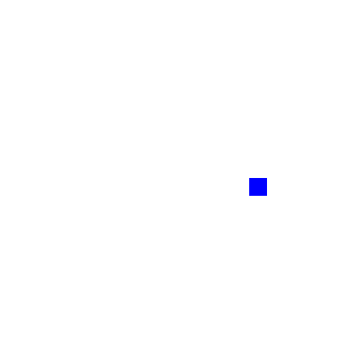

- [x] Faça uma animação em ciclo com algum padrão (ex, andar em círculo).
   - [x] Explique a animação textualmente:
       - Um quadrado faz um caminho circular em volta do centro da tela, implementado da forma mais simples, usando seno e cosseno.
       - Alternativamente (definindo o símbolo LISSAJOUS), o quadrado faz um caminho no formato de uma "flor". Implementado alterando o raio do círculo numa sincronia diferente da posição.
   - [x] Use somente as funções vistas nos slides anteriores.
   - [ ] Use a velocidade de 10 pixels/segundo.
   - [x] Use somente um loop no código.
- [x] Coloque o código no GitHub.
- [x] Adicione um screenshot do programa em execução. Se possível, animado (vídeo, gif, youtube) ou algumas fotos.
    - 
    - 
